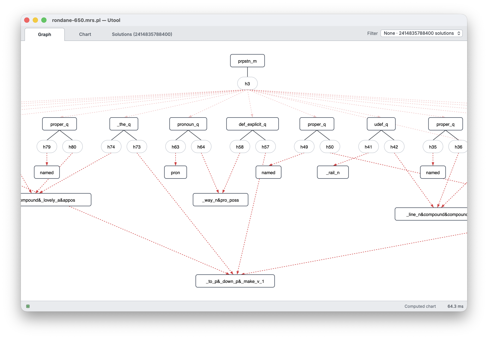

# Utool


Utool is the Swiss Army Knife of Underspecification. It is a GUI and library written in Rust for performing computations with dominance graphs and other formalisms, which are used to represent semantic ambiguities in natural language processing.




Utool was developed in 2005-2010 in the CHORUS Project at  [Saarland University](https://www.lst.uni-saarland.de/) by [Alexander Koller](https://www.coli.uni-saarland.de/koller/) and collaborators. It is no longer under active development, but it is probably still the fastest solver for underspecified representations of scope ambiguities, and will still run fine today. If you have any questions or requests, please get in touch by submitting a Github issue.

In 2026, in response to sustained interest in Utool, we released Utool 4: a streamlined port of Utool to Rust from the original Java. This increased the speed of chart generation and solution enumeration by a factor of 10x. Chart filtering (with rewrite rules) can now be done efficiently even on dominance graphs where the Java version ran out of memory. A Macbook Pro with M5 Pro processor computes the chart for the [hardest example in the testsuite](https://github.com/coli-saar/utool/blob/master/src/main/resources/examples/rondane-650.mrs.pl) in 55 milliseconds, reduces to weakest readings in 700 milliseconds, and enumerates the remaining 1.9 million readings in 200 milliseconds.

The [Utool homepage](https://coli-saar.github.io/utool/) has a [detailed manual](https://coli-saar.github.io/utool/manual/). The manual is written for Utool 3.1 (in Java), but Utool 4 is mostly a drop-in replacement for 3.4, so the key points still apply.


## Running Utool


Prebuilt command-line programs and desktop packages for Utool 4 are published on the
[GitHub Releases page](https://github.com/coli-saar/utool/releases). Release
artifacts are built for these targets:

<!-- release-downloads:start version=4.1.0 -->
| Platform | Desktop application | Command line program |
| --- | --- | --- |
| macOS, Apple Silicon | [DMG](https://github.com/coli-saar/utool/releases/download/v4.1.0/Utool_4.1.0_aarch64.dmg) · [app archive](https://github.com/coli-saar/utool/releases/download/v4.1.0/Utool_aarch64.app.tar.gz) | [tar.gz](https://github.com/coli-saar/utool/releases/download/v4.1.0/utool-4.1.0-aarch64-apple-darwin.tar.gz) |
| macOS, Intel | [DMG](https://github.com/coli-saar/utool/releases/download/v4.1.0/Utool_4.1.0_x64.dmg) · [app archive](https://github.com/coli-saar/utool/releases/download/v4.1.0/Utool_x64.app.tar.gz) | [tar.gz](https://github.com/coli-saar/utool/releases/download/v4.1.0/utool-4.1.0-x86_64-apple-darwin.tar.gz) |
| Windows x64 | [installer](https://github.com/coli-saar/utool/releases/download/v4.1.0/Utool_4.1.0_x64-setup.exe) | [zip](https://github.com/coli-saar/utool/releases/download/v4.1.0/utool-4.1.0-x86_64-pc-windows-msvc.zip) |
| Linux x64 | [AppImage](https://github.com/coli-saar/utool/releases/download/v4.1.0/Utool_4.1.0_amd64.AppImage) · [Debian package](https://github.com/coli-saar/utool/releases/download/v4.1.0/Utool_4.1.0_amd64.deb) | [tar.gz](https://github.com/coli-saar/utool/releases/download/v4.1.0/utool-4.1.0-x86_64-unknown-linux-gnu.tar.gz) |
<!-- release-downloads:end -->

For the easiest start, download and run the desktop application. This will allow you to open, convert, and solve dominance graphs. You can also activate the server model in the desktop app, which allows you to send XML commands for solving dominance graphs from other programs over a socket.

Alternatively, you can download the command-line program and then run it in your shell. This is most suitable for batch processing.

The packages are not developer-signed or notarized. Windows SmartScreen and
macOS Gatekeeper may therefore ask you to approve the application before its
first launch. Download releases only from the repository's Releases page and
verify that you selected the expected version and architecture.
The binaries you have to approve are called `utool` and `utool-display`.

The [last Java version](https://github.com/coli-saar/utool/releases/tag/utool-3.4), Utool 3.4, is still available on the Releases page if you wish to use that instead.


## Citing Utool

If you use Utool in your research, you can cite it as follows:

```
@inproceedings{koller-thater-2005-evolution,
    title = "The Evolution of Dominance Constraint Solvers",
    author = "Koller, Alexander and Thater, Stefan",
    booktitle = "Proceedings of Workshop on Software",
    year = "2005",
    address = "Ann Arbor, Michigan",
    url = "https://aclanthology.org/W05-1105",
    pages = "65--76",
}
```


Our own most recent publication that uses Utool is this one. You can
cite it if you are computing weakest readings or performing redundancy
elimination with Utool.

```
@inproceedings{koller-thater-2010-computing,
    title = "Computing Weakest Readings",
    author = "Koller, Alexander and Thater, Stefan",
    booktitle = "Proceedings of the 48th Annual Meeting of the Association for Computational Linguistics",
    year = "2010",
    address = "Uppsala, Sweden",
    url = "https://aclanthology.org/P10-1004",
    pages = "30--39",
}
```	
